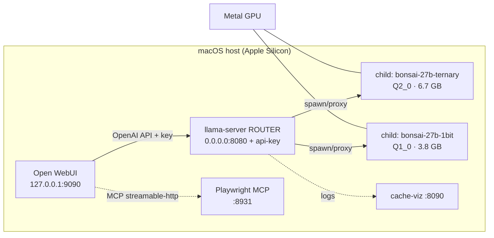
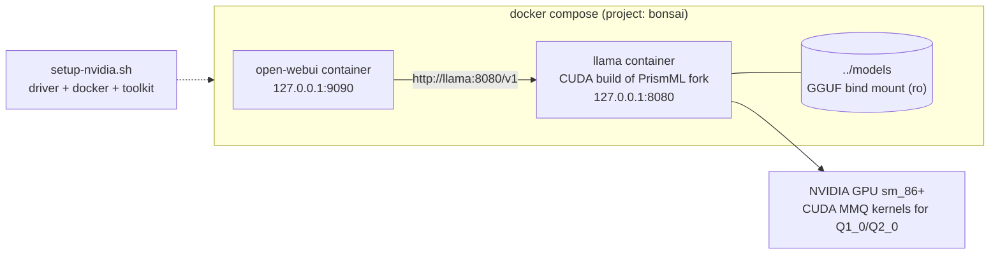
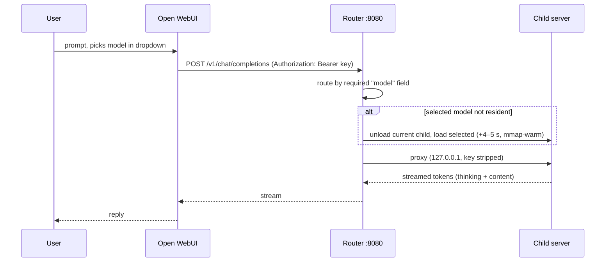

# PRD — QuickCleverModel

**Status:** v1, shipped (macOS native + Linux/NVIDIA Docker paths working)
**Repo:** https://github.com/KSEGIT/QuickCleverModel
**Date:** 2026-08-09

## 1. Problem statement

Running a 27B-parameter reasoning model locally usually means picking between
quality (large quants that need datacenter VRAM) and speed (aggressive quants
that fall apart). The PrismML Bonsai-27B family — 1-bit `Q1_0` and ternary
`Q2_0` at 89.5–94.6% of FP16 quality — makes a consumer GPU viable, but the
weights only load in the PrismML llama.cpp fork (upstream rejects the block
layout), the fork has no turnkey serving setup, and a usable local assistant
needs more than a model server: chat UI, model switching, auth, and tooling.

QuickCleverModel packages all of that into one repo that runs on hardware
people actually own: an Apple Silicon Mac (Metal) or an Ubuntu box with a
consumer NVIDIA card (CUDA, validated target RTX 3070 Ti 8 GB).

## 2. Goals / non-goals

**Goals**

- One-command startup on both platforms (`make up` / `docker compose up`).
- Both quantizations served from one port, switchable in the UI without restart.
- Reasoning (thinking) mode preserved and configurable.
- Secure by default: API key enforced, loopback-only UIs, no secrets in git.
- Consumer-hardware first: measured defaults for 8 GB VRAM and 24 GB unified memory.

**Non-goals**

- Multi-user / hosted deployment (single-user local box).
- Training, fine-tuning, or quantization tooling.
- Upstream llama.cpp compatibility (the fork is a hard requirement).
- Kubernetes or orchestration beyond docker compose.

## 3. Users and target hardware

| User | Hardware | Path |
|---|---|---|
| Developer on Apple Silicon | M-series, 24 GB unified memory | native Metal via `stack.sh` |
| Developer with a PC GPU | Ubuntu 20.04–24.04, NVIDIA ≥ 8 GB VRAM (sm_86+) | `docker/compose.linux.yaml` (CUDA) |

Measured baselines (Apple M5, 24 GB): ternary 10.5–12.9 tok/s, 1-bit 16.1 tok/s
generation with the shipped tuning. An RTX 4060 Laptop (256 GB/s) runs the same
1-bit file at ~22 tok/s; the 3070 Ti (608 GB/s) should exceed that.

## 4. Functional requirements

| # | Requirement | Status |
|---|---|---|
| F1 | Serve `bonsai-27b-ternary` (Q2_0, 6.7 GB) and `bonsai-27b-1bit` (Q1_0, 3.8 GB) from one OpenAI-compatible endpoint | ✅ |
| F2 | Router mode: model selected per request via the `model` field; one child resident by default (`--models-max 1`), swap cost +4–5 s; `BONSAI_MODELS_MAX=2` keeps both hot | ✅ |
| F3 | Vision input on both models (per-section `mmproj` in `models.ini`) | ✅ |
| F4 | Chat UI (Open WebUI) with model dropdown, browser tools via Playwright MCP (streamable-HTTP) | ✅ |
| F5 | API key auth at the router (401 without/with bad key); children bound to loopback and stripped of the key | ✅ |
| F6 | Weight downloader with size verification, resumable and idempotent | ✅ |
| F7 | One-shot NVIDIA host setup (`setup-nvidia.sh`) with auto-detection and `--check` dry-run | ✅ |
| F8 | Reproducible CUDA build of the fork, pinned commit, multi-stage Dockerfile | ✅ (build unverified on real hardware) |
| F9 | Prompt-cache dashboard (`cache-viz.py`) + unittest suite | ✅ |
| F10 | Thinking mode on by default; `--reasoning off` / `--reasoning-budget` passthrough | ✅ |

## 5. Non-functional requirements

| # | Requirement | Measured |
|---|---|---|
| N1 | Generation ≥ 10 tok/s on Apple M5 (ternary) | 10.5–12.9 ✅ |
| N2 | Fit the 1-bit model + KV cache in 8 GB VRAM at ctx 8192 | fits by construction; on-hardware run pending |
| N3 | No secrets in the public repo (weights, keys, venv all gitignored; verified by tree inspection) | ✅ |
| N4 | UIs unauthenticated-reachable only on loopback; LAN exposure is opt-in | ✅ |
| N5 | `make up` readiness = ports accepting connections, not process start | ✅ |
| N6 | Everything restartable as plain user processes / containers; nothing survives reboot by default | ✅ |

## 6. Architecture

### 6.1 System overview — macOS (native Metal)

The router loads no weights itself: it spawns one child `llama-server` per
`models.ini` section (loopback-only, key-stripped) and proxies by model id.

### 6.2 System overview — Linux + NVIDIA (all Docker)

### 6.3 Request flow

### 6.4 Key design decisions

| Decision | Rationale |
|---|---|
| Inference native on macOS, not Docker | Docker Desktop's Linux VM exposes no GPU to containers |
| Fork pinned by commit in Dockerfile | Reproducible CUDA builds; upstream can't read Q2_0 anyway |
| Router with one resident model | 24 GB Mac / 8 GB GPU can't hold both + KV cache comfortably; swap is +4–5 s |
| `BONSAI_CTX=8192` on the 8 GB path | Ternary weights + mmproj are 7.3 GB; KV cache must fit alongside |
| API key even on loopback-docker | Router binds 0.0.0.0 for the container bridge; key is the only barrier |
| Loopback-only published ports | Open WebUI runs with `WEBUI_AUTH=false`; LAN exposure must be deliberate |

## 7. Success metrics

- Cold start to first token: `make up` readiness-gated; model swap +4–5 s warm.
- Throughput: `make bench` (median of N reps) per platform; README records
  measured numbers, not vendor claims.
- Quality: vendor ratings 94.6% (ternary) / 89.5% (1-bit) of FP16.
- Reliability: stack survives `make down` with no orphaned children (verified).

## 8. Out of scope / future

- MLX 1-bit runtime (~21–27 tok/s projected on Apple Silicon) — separate runtime, unbuilt.
- Windows support; AMD GPUs (fork has HIP paths, untested).
- Multi-model beyond the Bonsai family (upstream BitNet `TQ*` types have no Metal kernels here).
- Playwright MCP inside the Linux Docker path (currently host-native only).
