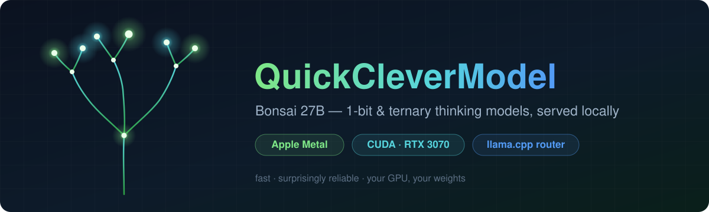

<p align="center">
  
</p>

# QuickCleverModel — Bonsai 27B, fast on consumer GPUs

## What is this?

This runs a 27B thinking AI model on your own computer. You need a Mac with
Apple Silicon, or a Linux PC with an NVIDIA card (tested on an RTX 3070 Ti
with 8 GB). The model weights are free and open. Everything is private —
nothing leaves your machine. You talk to the model in a web page in your
browser.

## Quick setup

**Linux + NVIDIA** (tested on Ubuntu, RTX 3070 Ti 8 GB) — two commands:

```bash
git clone https://github.com/KSEGIT/QuickCleverModel.git && cd QuickCleverModel
./install.sh
```

The first run takes 10–20 minutes (it builds the CUDA image) and downloads
about 11 GB of model weights. It is safe to re-run after any failure.
Every setting the stack understands is documented in
[.env.example](.env.example).

Then open `http://127.0.0.1:9090` and pick **`bonsai-27b-1bit`** in the
dropdown. The first answer takes 10–20 seconds while the model loads.

**macOS (Apple Silicon):** the setup is a few steps more — see
[docs/macos.md](docs/macos.md#first-time-setup-macos).

## Remote access

Ports listen on loopback only. Nothing outside the box can reach them until
you choose one of these.

**Option 1 — SSH tunnel (safest, no config change).** Run this on your laptop,
then open `http://127.0.0.1:9090` as usual:

```bash
ssh -N -L 9090:127.0.0.1:9090 -L 8080:127.0.0.1:8080 user@<box-ip>
```

**Option 2 — Tailscale bind (good for daily use).** The box keeps the ports
open on its Tailscale address, so any machine on your tailnet can connect. On
the box, add this to `.env` (use the box's own Tailscale IP, from
`tailscale ip -4`):

```bash
WEBUI_BIND=100.x.y.z
LLAMA_BIND=100.x.y.z
```

Then restart: `docker compose --env-file .env -f docker/compose.linux.yaml up -d`.

Warning: the chat UI has no login by default. Binding it opens the UI to your
whole tailnet. On a shared tailnet, set `WEBUI_AUTH: "true"` in
`docker/compose.linux.yaml` first. The API on :8080 always asks for the key.

Never use `0.0.0.0` unless you mean to share with the whole office LAN.

From another machine, the API is now at `http://100.x.y.z:8080/v1` — point any
OpenAI-compatible tool there (OpenCode, Aider, scripts) with your
`BONSAI_API_KEY`. More detail: [docs/architecture.md](docs/architecture.md#ports--security).

## Using it

Two versions of the same model. Pick one in the dropdown:

| model | size | quality | pick it when |
|---|---|---|---|
| `bonsai-27b-ternary` | 6.7 GB | 94.6% of FP16 | you want the best answers and have the memory |
| `bonsai-27b-1bit` | 3.8 GB | 89.5% of FP16 | you want speed, or you have 8 GB VRAM |

The model thinks before it answers. Short answers can hide inside the
thinking; `--reasoning off` turns thinking off. Details:
[docs/macos.md](docs/macos.md#thinking-mode).

API example (OpenAI-compatible):

```bash
curl http://127.0.0.1:8080/v1/chat/completions \
  -H "Authorization: Bearer $BONSAI_API_KEY" -H "Content-Type: application/json" \
  -d '{"model":"bonsai-27b-1bit","messages":[{"role":"user","content":"hi"}]}'
```

Useful commands:

- macOS: `make up` start, `make down` stop, `make status` check, `make logs`
  watch logs, `make bench` measure speed, `make menubar-install` for a menu
  bar icon with stack status and restart/stop.
- Linux: `docker compose --env-file .env -f docker/compose.linux.yaml up -d`
  to start, same command with `down` to stop.

## Documentation

- [docs/PRD.md](docs/PRD.md) — what this project is for and what it must do.
- [docs/architecture.md](docs/architecture.md) — how the parts fit together on both platforms.
- [docs/decisions.md](docs/decisions.md) — why we built it this way, with measured evidence.
- [docs/tuning.md](docs/tuning.md) — speed numbers measured on this machine.
- [docs/macos.md](docs/macos.md) — setup and day-to-day use on a Mac.
