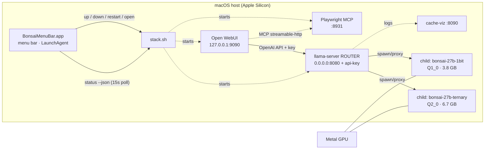
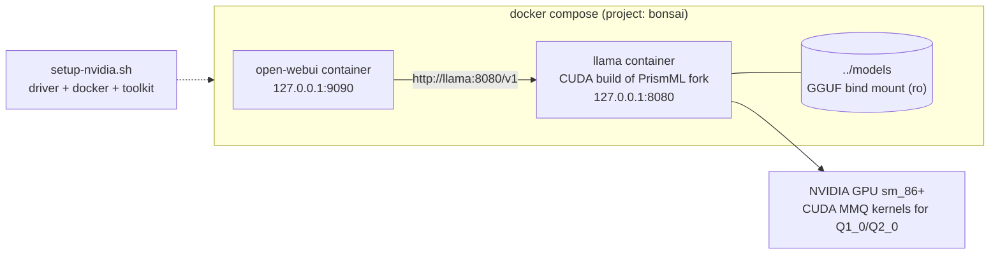
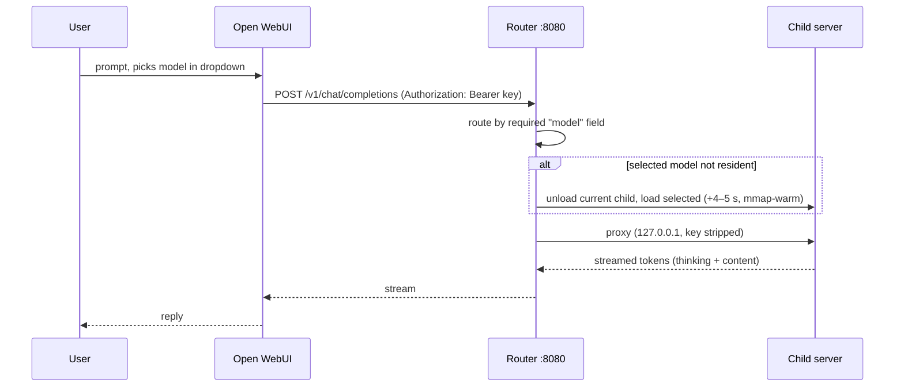

# Architecture

Two run modes: **native Metal on macOS** (with a Docker app layer) and a
**full Docker stack on Linux + NVIDIA**. The models reason (thinking mode) and
hold up surprisingly well for 1-bit/ternary weights.

## macOS shape — native Metal

Docker on macOS **cannot** use your GPU. Containers run inside a Linux VM on
Apple's Hypervisor/Virtualization framework, which exposes virtual CPUs and
memory but **no virtual GPU** — there is no Metal device to pass through, and no
`--gpus` equivalent. Docker's own Model Runner sidesteps this by running
inference engines as sandboxed *host* processes rather than in containers.

So: **inference runs natively on the host with Metal; clients talk to it over HTTP.**

The container→host bridge is verified working (see
[macos.md](macos.md#verified)), but the UI currently runs natively too, because
Docker Desktop's registry proxy wedged mid-setup — see
[macos.md](macos.md#docker-registry-proxy-known-issue-on-this-machine).

```
┌─────────────────────────── macOS host (Apple M5) ───────────────────────────┐
│                                                                             │
│   llama-server ROUTER  ──────────────────────────────  0.0.0.0:8080         │
│   (prism fork, source-built)                       ▲        ▲               │
│     ├─ child: bonsai-27b-ternary  Q2_0  6.7 GB  ─┐ │        │               │
│     └─ child: bonsai-27b-1bit     Q1_0  3.8 GB  ─┤ │        │               │
│          both on Metal / MTLGPUFamilyApple10     │ │        │               │
│          one resident at a time (--models-max 1) ┘ │        │               │
│                                                    │        │               │
│   open-webui (native, :9090) ──────────────────────┘        │ host.docker.internal
│                                                             │               │
│   BonsaiMenuBar.app  ──► stack.sh ──► starts/stops the three services above  │
│   (menu bar, LaunchAgent; polls `stack.sh status --json` every 15s)          │
│                                                             │               │
│   ┌─────────────── Docker Desktop Linux VM ──────────────────┼────────────┐ │
│   │   any container ─────────────────────────────────────────┘            │ │
│   │   (verified: curl container got a completion at 13.0 tok/s)           │ │
│   └───────────────────────────────────────────────────────────────────────┘ │
└─────────────────────────────────────────────────────────────────────────────┘
```



The router loads no model itself. It spawns one child `llama-server` per model in
`models.ini` and proxies each request to the right child, so both quantizations
appear in the Open WebUI dropdown and you switch between them without a restart.

## Linux/NVIDIA shape — all Docker

The same stack runs fully containerised on a Linux box with an NVIDIA GPU —
developed against an RTX 3070 Ti (8 GB VRAM, sm_86). `docker/Dockerfile` builds
the prism fork's `llama-server` with CUDA (the fork's Q1_0/Q2_0 kernels work on
the standard MMQ path, sm_86 included), and `docker/compose.linux.yaml` runs it
alongside Open WebUI.



Quick start — one command installs the prerequisites (driver/Docker/toolkit
via `setup-nvidia.sh`), the `hf` CLI, downloads the weights (~11 GB),
generates `.env`, builds and starts the stack, and waits until the UI
answers:

```bash
git clone https://github.com/KSEGIT/QuickCleverModel.git && cd QuickCleverModel
./install.sh             # --check to dry-run; safe to re-run, every step idempotent
```

After a fresh driver install it will tell you to reboot and re-run — it
resumes where it left off. The first build takes 10–20 minutes (CUDA
compile).

<details>
<summary>Manual steps (exactly what install.sh runs, if you prefer to drive it yourself)</summary>

Prerequisites on the host — either run `./setup-nvidia.sh` (auto-detects and
installs driver/Docker/nvidia-container-toolkit, `--check` to dry-run), or set
up manually:

- NVIDIA driver **>= 525** (required by CUDA 12.4)
- Docker (with the Compose plugin) + **nvidia-container-toolkit**, then
  `sudo nvidia-ctk runtime configure --runtime=docker && sudo systemctl restart docker`
- the `hf` CLI for the weight download — on Ubuntu >= 23.04 use
  `pipx install huggingface_hub[cli]` (a bare `pip install` hits PEP 668's
  externally-managed error); older releases can use `pip install -U "huggingface_hub[cli]"`

```bash
./fetch-models.sh        # ~11 GB, both models — lands in models/.
                         # Run this BEFORE first compose up: it creates models/
                         # itself; if docker creates the bind-mount source
                         # first, it is root-owned and the download fails.
printf 'BONSAI_API_KEY=bonsai-%s\n' "$(openssl rand -hex 20)" > .env && chmod 600 .env
# --env-file .env is REQUIRED: compose interpolation reads the shell env and
# the project-dir .env (docker/), not the repo-root one — without this flag
# the OPENAI_API_KEY line fails with "required variable is missing a value".
docker compose --env-file .env -f docker/compose.linux.yaml up --build -d
```

</details>

UI on http://127.0.0.1:9090, API on :8080 — same router mode, same model ids,
same `.env` key as the macOS stack.

**8 GB VRAM caveat.** Compose defaults to `BONSAI_CTX=8192` so the KV cache
fits next to the weights. The ternary Q2_0 (7.3 GB with mmproj) is tight at
that ctx; the 1-bit Q1_0 is comfortable and can go much higher:

```bash
BONSAI_CTX=32768 docker compose --env-file .env -f docker/compose.linux.yaml up -d
```

## Request flow



### Model selection

Two quantizations of the same 27B are served from one port and chosen in the
Open WebUI dropdown:

| model id | quant | file | vendor quality | vision |
|---|---|---|---|---|
| `bonsai-27b-ternary` | `Q2_0`, 2.125 bpw | 6.7 GB | 94.6% of FP16 | ✓ |
| `bonsai-27b-1bit` | `Q1_0`, 1.125 bpw | 3.8 GB | 89.5% of FP16 | ✓ |

Both run on Metal — `Q1_0` is a first-class type in this fork (`llama-quantize`
lists it, and `ggml-metal.metal` carries its kernels), so the 1-bit model is GPU
accelerated, not a CPU fallback. Note this does **not** hold for `TQ1_0`/`TQ2_0`,
the upstream BitNet types: they have no Metal kernels here, so an upstream BitNet
GGUF would run CPU-only. Staying in the Bonsai family avoids that.

**One model is resident at a time** (`--models-max 1`). Selecting the other in
the dropdown unloads the current child and loads the new one from disk. Measured
cost of a switch, with the machine under other load:

| | wall clock |
|---|---|
| request to the model already loaded | 4–7 s |
| request that switches model | 8–12 s |

So a switch costs roughly **+4–5 s**. The weights are `mmap`ed, so the OS page
cache keeps them warm and a reload is far cheaper than a cold 3.8–6.7 GB read.

`BONSAI_MODELS_MAX=2` keeps both resident and makes switching instant. This was
tested and **works** — both children loaded, served six alternating requests, and
logged no allocation failures, even while the machine was already 12 GB into
swap. It is not the default only because one-at-a-time leaves more headroom for
everything else on the box — see [decisions.md](decisions.md).

### Adding another model

`models.ini.in` is the committed template; `start-server.sh` interpolates `@ROOT@`
and writes `run/models.ini`, which is what the router reads. A new model is a new
section — the section name becomes the model id in the dropdown, because the
router force-sets `--alias` to it (`server-models.cpp:154`).

Two traps, both of which cost time here:

- **`mmproj` must be declared per-section.** On the router's own command line it
  is silently discarded (`unset_reserved_args(base_preset, true)`,
  `server-models.cpp:210`), and the model loses image input with no error.
- **Do not add the `version = 1` line** that the fork's own README example shows.
  Any key before the first `[section]` header lands in a section named `default`
  (`preset.cpp:254`), which then inherits the `[*]` globals and appears in
  `/v1/models` as a phantom model with no weights. Observed: with that line
  present `/v1/models` returned three entries instead of two.

### API

In router mode the `"model"` field is **required** on POST — without it the
router answers `400 model name is missing from the request`. GET endpoints
(`/props`, `/metrics`) take a `?model=` query parameter instead.

```bash
curl http://127.0.0.1:8080/v1/chat/completions \
  -H "Authorization: Bearer $BONSAI_API_KEY" -H "Content-Type: application/json" \
  -d '{"model":"bonsai-27b-1bit","messages":[{"role":"user","content":"hi"}]}'
```

Router mode is marked experimental upstream (`server.cpp:340` prints
`NOTE: router mode is experimental`).

## Control plane

`stack.sh` is the only thing that starts, stops, or inspects services. Every
other control surface is a client of it, and none of them reimplement its
knowledge of ports, PIDs, or start order.

```
  make up/down/status        ─┐
  ./stack.sh directly        ─┼─►  stack.sh  ─►  start-server.sh
  BonsaiMenuBar.app          ─┘                  start-playwright-mcp.sh
                                                 start-webui.sh
```

The macOS menu bar app (`menubar/BonsaiMenuBar.swift`, built by `make menubar`)
talks to it through **`./stack.sh status --json`**, not by parsing the human
table that `status` prints. That separation is deliberate: the table is a UI and
will change, so a cosmetic edit to its `printf` must not be able to break a
consumer. The JSON is the contract:

```json
[{"service":"llama","port":8080,"state":"up","pid":57187}, …]
```

One object per service in `SERVICES` order; `pid` is a number exactly when
`state` is `"up"` and `null` exactly when `"down"`. Ports come from `port_of`,
so `BONSAI_PORT` / `PW_MCP_PORT` / `WEBUI_PORT` overrides are reflected.
`tests/test_stack_status_json.py` pins this shape from the shell side.

Two constraints fall out of the app being a launchd agent rather than a shell
child, both of which bit us in practice:

- **launchd gives agents a minimal `PATH`** (`/usr/bin:/bin:/usr/sbin:/sbin`),
  which has no Homebrew, so `npx` was unresolvable and Restart could stop the
  stack without being able to start it again. `stack.sh` normalizes `PATH`
  itself — after sourcing `.env`, so a `PATH=` line there cannot defeat it —
  and the LaunchAgent plist sets it too.
- **A LaunchServices-started app inherits cwd `/`**, so subprocesses wrote into
  the filesystem root until `capture()` pinned cwd to the script's directory.

Any future control surface (a Windows tray app, a web control page) should
consume `status --json` and shell out to `stack.sh` the same way, rather than
growing its own service model.

## Ports & security

`start-server.sh` binds `0.0.0.0` because binding `127.0.0.1` would be
unreachable from the Docker VM — which also makes it reachable from your LAN.
An API key in `.env` (gitignored, mode 600) is therefore required, and enforced.
Re-verified against the router:

```
/v1/chat/completions   no-key 401   bad-key 401   good-key 200
/props                 no-key 401
/models/load           no-key 401      (the load/unload control endpoint)
```

The key is enforced once, at the router. Children bind `127.0.0.1` and are
stripped of it (`unset_reserved_args`), so it is not duplicated per model —
confirmed absent from the unauthenticated `/v1/models` response.

Two endpoints are public by upstream design, not by regression:
`/health` and `/v1/models` both return 200 without a key
(`tools/server/tests/unit/test_security.py` asserts this). On a `0.0.0.0` bind
that means anyone on your LAN can read the model list, **including each child's
full command line and absolute weight paths**. No credentials leak, but if that
bothers you, put the box behind a firewall rule rather than relying on the key.

On the Linux/NVIDIA path, **both ports are loopback-only by default**
(`127.0.0.1:8080` / `:9090`) — the webui runs with `WEBUI_AUTH=false`, so
publishing it would give your whole LAN an unauthenticated chat UI. The API key
on :8080 is enforced either way.

**Remote access** (e.g. you SSH into the box over Tailscale and browse from
another machine): two options.

- Preferred — an SSH tunnel from your local machine, no config change:

  ```bash
  ssh -N -L 9090:127.0.0.1:9090 -L 8080:127.0.0.1:8080 user@<tailscale-ip>
  # then open http://127.0.0.1:9090 locally
  ```

- Or bind to the Tailscale interface: add `WEBUI_BIND=100.x.y.z` (the box's
  Tailscale IP) to `.env`, then `docker compose --env-file .env -f docker/compose.linux.yaml up -d`
  to recreate. This exposes the **unauthenticated** UI to your whole tailnet —
  fine on a personal tailnet, otherwise flip `WEBUI_AUTH` to `true` first.
  `LLAMA_BIND` does the same for :8080 (the API key is enforced there).

On macOS, `make menubar-install` adds `stack.sh` execution as a persistent,
login-session trigger: the installed LaunchAgent starts the menu bar app at
login, and it runs `stack.sh status --json` on a 15s timer plus `stack.sh`
verbs on every action for as long as the user is logged in. Write access to
`stack.sh` (or to anything on its `PATH`) is therefore equivalent to code
execution in that user's session, not just at the moment someone happens to
run `./stack.sh` by hand.
